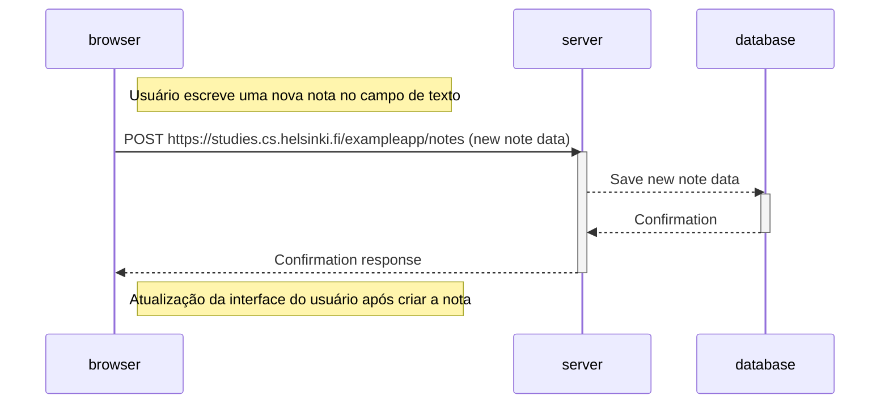

# teste-mermaid

```mermaid
sequenceDiagram
    participant browser
    participant server
    participant database

    Note right of browser: Usuário escreve uma nova nota no campo de texto

    browser->>server: POST https://studies.cs.helsinki.fi/exampleapp/notes (new note data)
    activate server
    server-->>database: Save new note data
    activate database
    database-->>server: Confirmation
    deactivate database
    server-->>browser: Confirmation response
    deactivate server

    Note right of browser: Atualização da interface do usuário após criar a nota
```
