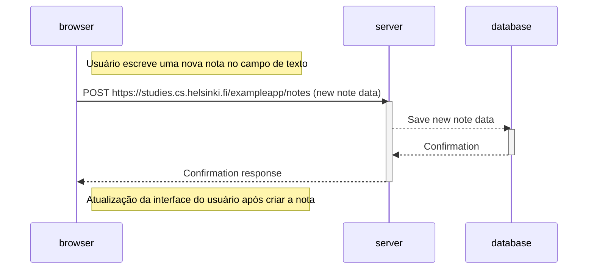
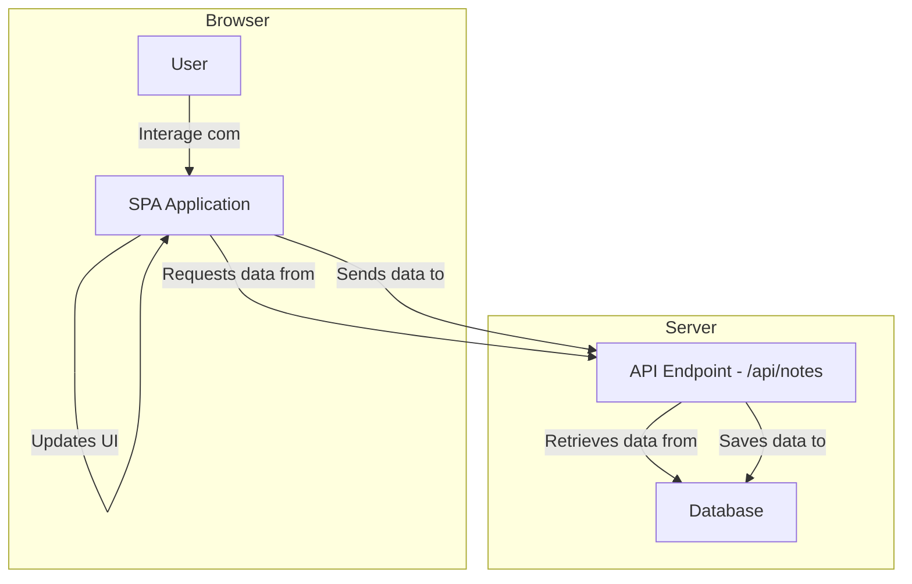
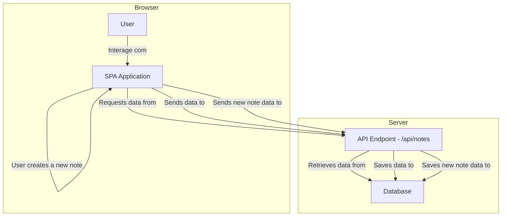
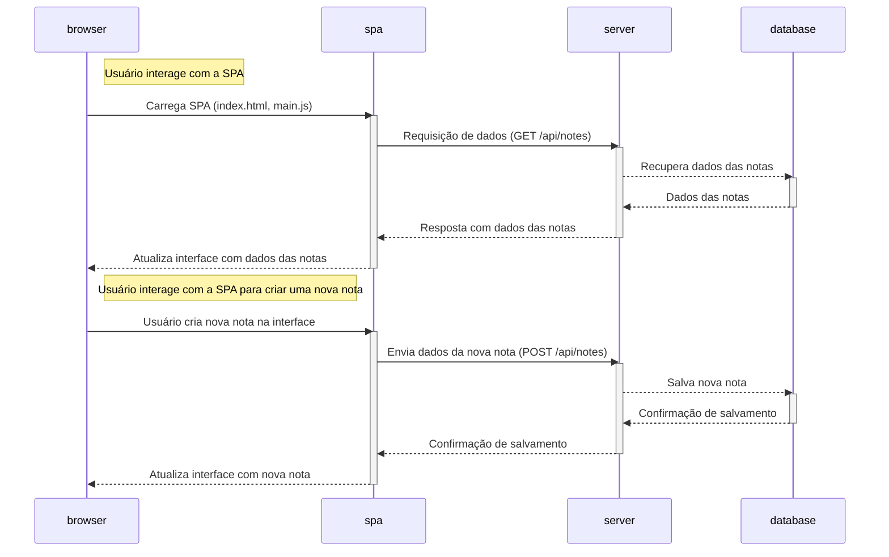

# teste-mermaid

```mermaid
sequenceDiagram
    participant browser
    participant server
    participant database

    Note right of browser: Usuário escreve uma nova nota no campo de texto

    browser->>server: POST https://studies.cs.helsinki.fi/exampleapp/notes (new note data)
    activate server
    server-->>database: Save new note data
    activate database
    database-->>server: Confirmation
    deactivate database
    server-->>browser: Confirmation response
    deactivate server

    Note right of browser: Atualização da interface do usuário após criar a nota
```

```mermaid
graph TD
  subgraph Browser
    a[User]
    b[SPA Application]
  end

  subgraph Server
    c[API Endpoint - /api/notes]
    d[Database]
  end

  a -->|Interage com| b
  b -->|Requests data from| c
  c -->|Retrieves data from| d
  b -->|Updates UI| b
  b -->|Sends data to| c
  c -->|Saves data to| d
```

```mermaid
graph TD
  subgraph Browser
    a[User]
    b[SPA Application]
  end

  subgraph Server
    c[API Endpoint - /api/notes]
    d[Database]
  end

  a -->|Interage com| b
  b -->|Requests data from| c
  c -->|Retrieves data from| d
  b -->|Updates UI| b
  b -->|Sends data to| c
  c -->|Saves data to| d
  b -->|User creates a new note| b
  b -->|Sends new note data to| c
  c -->|Saves new note data to| d
```

```mermaid
sequenceDiagram
    participant browser
    participant spa
    participant server
    participant database

    Note right of browser: Usuário interage com a SPA

    browser->>spa: Carrega SPA (index.html, main.js)
    activate spa
    spa->>server: Requisição de dados (GET /api/notes)
    activate server
    server-->>database: Recupera dados das notas
    activate database
    database-->>server: Dados das notas
    deactivate database
    server-->>spa: Resposta com dados das notas
    deactivate server
    spa-->>browser: Atualiza interface com dados das notas
    deactivate spa

    Note right of browser: Usuário interage com a SPA para criar uma nova nota

    browser->>spa: Usuário cria nova nota na interface
    activate spa
    spa->>server: Envia dados da nova nota (POST /api/notes)
    activate server
    server-->>database: Salva nova nota
    activate database
    database-->>server: Confirmação de salvamento
    deactivate database
    server-->>spa: Confirmação de salvamento
    deactivate server
    spa-->>browser: Atualiza interface com nova nota
    deactivate spa
```
