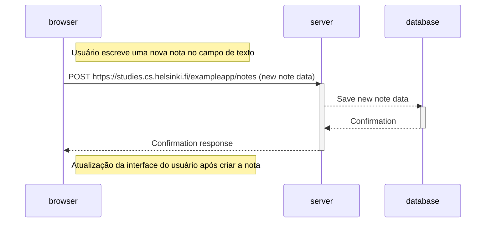
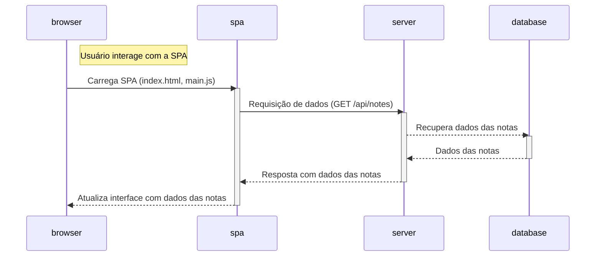
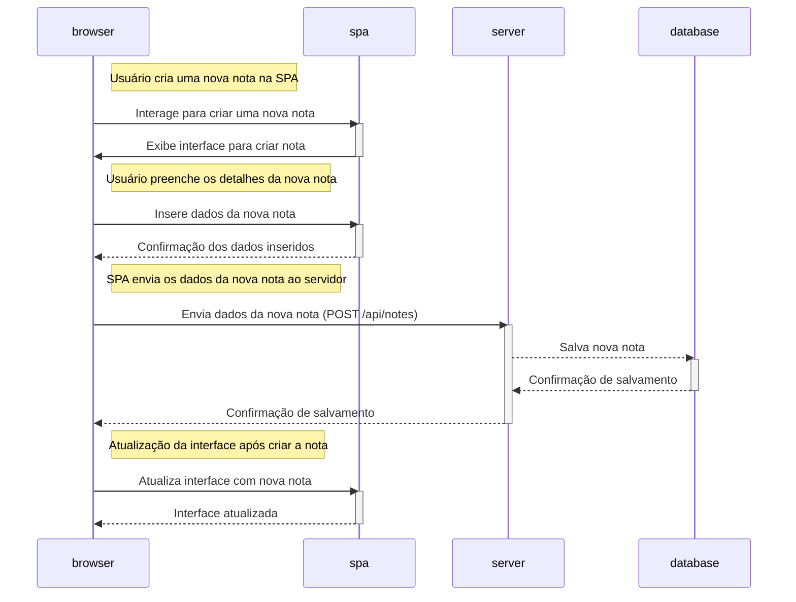

# teste-mermaid

```mermaid
sequenceDiagram
    participant browser
    participant server
    participant database

    Note right of browser: Usuário escreve uma nova nota no campo de texto

    browser->>server: POST https://studies.cs.helsinki.fi/exampleapp/notes (new note data)
    activate server
    server-->>database: Save new note data
    activate database
    database-->>server: Confirmation
    deactivate database
    server-->>browser: Confirmation response
    deactivate server

    Note right of browser: Atualização da interface do usuário após criar a nota
```

```mermaid
sequenceDiagram
    participant browser
    participant spa
    participant server
    participant database

    Note right of browser: Usuário interage com a SPA

    browser->>spa: Carrega SPA (index.html, main.js)
    activate spa
    spa->>server: Requisição de dados (GET /api/notes)
    activate server
    server-->>database: Recupera dados das notas
    activate database
    database-->>server: Dados das notas
    deactivate database
    server-->>spa: Resposta com dados das notas
    deactivate server
    spa-->>browser: Atualiza interface com dados das notas
    deactivate spa
```

```mermaid
sequenceDiagram
    participant browser
    participant spa
    participant server
    participant database

    Note right of browser: Usuário cria uma nova nota na SPA

    browser->>spa: Interage para criar uma nova nota
    activate spa
    spa->>browser: Exibe interface para criar nota
    deactivate spa

    Note right of browser: Usuário preenche os detalhes da nova nota

    browser->>spa: Insere dados da nova nota
    activate spa
    spa-->>browser: Confirmação dos dados inseridos
    deactivate spa

    Note right of browser: SPA envia os dados da nova nota ao servidor

    browser->>server: Envia dados da nova nota (POST /api/notes)
    activate server
    server-->>database: Salva nova nota
    activate database
    database-->>server: Confirmação de salvamento
    deactivate database
    server-->>browser: Confirmação de salvamento
    deactivate server

    Note right of browser: Atualização da interface após criar a nota

    browser->>spa: Atualiza interface com nova nota
    activate spa
    spa-->>browser: Interface atualizada
    deactivate spa
```
